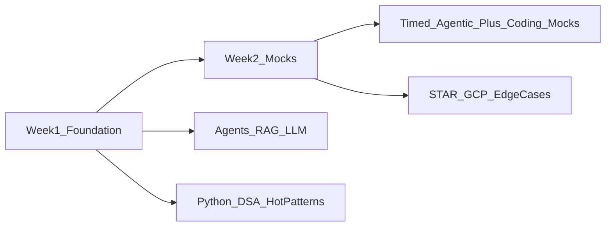

# Google GenAI Forward Deployed Engineer (FDE) — 2-Week Battle Plan

Actionable prep guide for the **GenAI FDE** loop. Base sources:

- Official PDF: [GenAI Forward Deployed Engineer (FDE) Prep Doc - Updated 4_22_2026.pdf](./GenAI%20Forward%20Deployed%20Engineer%20(FDE)%20Prep%20Doc%20-%20Updated%204_22_2026.pdf)
- Recruiter round mapping: Round 1 = live agentic AI / RRK; Round 2 = Coding (Python OOP + DSA)

**Study target (2 weeks):** ~6 agentic whiteboard sessions + ~10–12 serious Python VIP-style problems — not 300 LeetCode.

---

## 1. Interview process + round map

Per the official PDF:

- **Initial call** → prep → **2 virtual interviews** (60 min each) → **final review**
- A second person may shadow for interviewer calibration
- **Do not use AI tools during interviews**
- Role: embedded **innovator-builder** shipping **agentic GenAI** in customer environments (integration, data readiness, state management) — not pure advisory

| Round | What it is | What they evaluate |
|-------|------------|-------------------|
| **Round 1** | Live **agentic AI problem** over the call (maps to **RRK** / applied GenAI) | Clarify → architecture → tools/RAG/memory → failure modes → security/PII → cost/latency → how you’d ship/demo |
| **Round 2** | **Coding** on Google VIP (static editor, **Python OOP**, ~30–50 lines) + possible RRK depth if Round 1 was heavily agentic | Clarify aloud → algorithm + Big-O → production-ready Python → optimize → edge cases / test cases |

PDF RRK themes you may still get verbally in either round: AI/ML eng, ops excellence, security/privacy, scalability, cost/perf, GenAI concepts, consulting, cloud (your cloud + GCP name fluency), troubleshooting, system design under constraints.

---

## 2. Round 1 — Agentic AI playbook

Interviewers want you to **solve an open-ended agentic scenario on the call**: customer goal → agent design → ship under constraints.

### Framework to say aloud (every time)

1. **Clarify:** users, SLA, data sources, tools, online vs offline, success metric, must-not-do (PII, residency)
2. **Architecture:** LLM + tools + retrieval + memory/state + orchestration + observability
3. **Data:** indexing, chunking, freshness, access control / ACL
4. **Reliability:** retries, timeouts, fallbacks, human-in-the-loop, eval harness
5. **Security:** PII redaction, secrets, prompt injection, tenant isolation
6. **Scale / cost:** caching, smaller models for routing, batch vs realtime, token budget
7. **Ship / demo:** MVP path, what you’d code first in the customer env, how you’d prove value

### Concepts you must be fluent in

- **LLM lifecycle:** prompting, tool-calling, serving, hallucinations, grounding / citations
- **Agents:** ReAct-style loops, tool schemas, planning vs reacting, memory / state
- **RAG:** embeddings, chunking, hybrid search, rerank, citations, evals
- **Ops:** latency, retries, tracing, cost/token, rate limits
- **GCP (high-level):** Vertex AI, Gemini, Model Garden — answer in your known cloud if needed, then map names to GCP

### 8–10 practice scenarios (30–40 min aloud each)

1. **Customer-support agent** — CRM + KB search + ticket API + confident handoff to human when tools fail or intent is unsafe
2. **RAG over enterprise docs** — citations required, ACL/PII by tenant, freshness, eval set for grounding quality
3. **Multi-agent workflow** — planner + researcher + executor; shared state; retries; idempotent tool calls
4. **Prod agent is “wrong / flaky”** — structured troubleshooting (prompt? retrieval? tool schema? latency? data drift?)
5. **Latency budget** — design agent for X under p95 SLA; when to cache, shrink context, or route to smaller model
6. **Cost cap** — same product under strict $/day; batching, caching, routing, eval vs production traffic
7. **Data residency / private cloud** — agent that cannot leave VPC; what stays local vs API
8. **Website / app is slow** (PDF sample style) — marketing manager says new site is slow; clarify → measure → isolate (FE, CDN, API, DB, GenAI path) → fix / mitigate
9. **Demo for a stakeholder** — 2-week white-glove MVP: scope narrow win, instrumentation, rollback, next roadmap loop to Google product
10. **Tool dependency pipeline** — topo-ordered tools / DAG (some tools need others’ outputs); failure isolation

### Timing tip for a 60-min RRK / agentic round

- ~10 min clarify + requirements
- ~25–30 min architecture + deep dive (security or reliability)
- ~10 min scale/cost or troubleshooting
- ~5–10 min ship/demo + questions

---

## 3. Round 2 — Coding / DSA checklist (mapped to this repo)

Per PDF: **Python OOP**, static VIP (**no run**), **~30–50 lines**, clarify → algorithm → real code (no pseudocode) → optimize → test / edge cases. Intermediate–advanced **time/space**.

### Process drill (must be automatic)

Ask clarifying Qs → state algorithm + Big-O → write **real Python** → walk edge cases → add 2–3 verbal test cases → optimize if needed → keep “production-ready” (nulls, empty, duplicates, overflow-ish bounds).

### Priority topics → folders here

| Priority | Topic | Reuse from workspace (logic/patterns) | Practice as |
|----------|--------|----------------------------------------|-------------|
| 1 | Arrays / hash / two pointers / sliding window | [`Datastructure/Algorithms/TwoPointerApproach/`](../../Datastructure/Algorithms/TwoPointerApproach/), [`Datastructure/Algorithms/SlidingWindow/`](../../Datastructure/Algorithms/SlidingWindow/), [`Datastructure/Linear/Hashtable/`](../../Datastructure/Linear/Hashtable/), [`Datastructure/Algorithms/Map/`](../../Datastructure/Algorithms/Map/) | Python |
| 2 | Stacks / brackets / expression eval | [`Datastructure/Algorithms/Stack/`](../../Datastructure/Algorithms/Stack/), [`Datastructure/Linear/Stack-And-Queue/`](../../Datastructure/Linear/Stack-And-Queue/) | Python |
| 3 | Linked lists (reverse, cycle, merge) | [`Datastructure/Linear/LinkedList/`](../../Datastructure/Linear/LinkedList/) | Python |
| 4 | Trees / BFS–DFS | [`Datastructure/Non_Linear/Tree/BinaryTree/`](../../Datastructure/Non_Linear/Tree/BinaryTree/) | Python |
| 5 | Graphs (BFS/DFS, topo, shortest-path intuition) | [`Datastructure/Algorithms/Graph/`](../../Datastructure/Algorithms/Graph/), [`Datastructure/Non_Linear/Graphs/`](../../Datastructure/Non_Linear/Graphs/) | Python |
| 6 | Heaps / Top-K | [`Datastructure/Algorithms/Heaps_PQ/`](../../Datastructure/Algorithms/Heaps_PQ/), [`Datastructure/Non_Linear/Heaps/`](../../Datastructure/Non_Linear/Heaps/) | Python |
| 7 | Tries / Union-Find (if time) | [`Datastructure/Non_Linear/Tries/`](../../Datastructure/Non_Linear/Tries/), [`Datastructure/Non_Linear/UnionFind/`](../../Datastructure/Non_Linear/UnionFind/) | Python |
| 8 | OOP mini-designs (FDE-flavored) | Pattern ideas: [`Datastructure/Algorithms/Map/lruCache.js`](../../Datastructure/Algorithms/Map/lruCache.js), LLD in [`SystemDesign/LLD/`](../../SystemDesign/LLD/) | Python classes |

Also useful: [`Big O/`](../../Big%20O/), Google warmups in [`Company/GoogleInterview/`](../GoogleInterview/), pattern lists in root [`readme.md`](../../readme.md), classic problems under [`Programs/`](../../Programs/) if present.

### Example Round 2–style prompts (do these in Python)

- **Tool-calling agent loop** — register tools, call with JSON args, handle errors (~40 lines OOP)
- **LRU / TTL cache** — for embeddings or response cache
- **Parse / validate nested structures** — brackets, expression eval, JSON-like nesting
- **Rate limiter / token bucket**
- **Topo sort** — dependency order for tools / pipelines
- **Sliding window / stream stats** — moving average of latencies
- Classics: two-sum variants, merge intervals, valid parentheses, level-order tree, detect cycle

---

## 4. RRK topic flash list

Use as a mental checklist when the interviewer goes deep. One crisp talking point each.

### Security / privacy / compliance

- PII redaction before logs / prompts; least-privilege tool scopes
- Prompt injection: tool allowlists, output validation, never execute raw model text
- Tenant isolation: separate indexes, secrets, ACLs on retrieval
- Secrets in customer env (not in prompts); audit trails

### Scale

- 10k internal → millions external: multi-tenant quotas, async jobs, shard indexes
- Stateless serving + durable state store; backpressure / rate limits
- Horizontal tool workers; warm pools for cold-start latency

### Cost / performance

- Route simple intents to smaller/cheaper models; cache retrieval + completions
- Cap max tokens; batch offline workloads; measure $/successful task
- Latency: parallel tools, trim context, retrieval top-k + rerank tradeoff

### Consulting / customer skills

- Uncover stakeholders, success metric, constraints before proposing stack
- Recommend MVP that ships in their env; educate without overselling
- Dual role: ship for customer **and** feed product roadmap insights back to Google

### Troubleshooting (structured)

1. Clarify symptom + blast radius + when it started  
2. Reproduce / measure (latency, error rate, token use, tool fail codes)  
3. Bisect layers: client → network → API → retrieval → LLM → tools → data  
4. Mitigate (fallback, circuit break, human handoff) then root-cause  
5. PDF sample muscle: *“Website is slow”* → gather facts first, don’t jump to GenAI

### GenAI / cloud naming (flash)

- Vertex AI, Gemini, Model Garden, grounding / RAG patterns, Agent Builder (high-level)
- Speak your primary cloud fluently; map equivalents to GCP product names

---

## 5. 14-day calendar

Default split: **mornings = agentic / RRK**, **evenings = Python DSA / OOP**.

| Days | Focus |
|------|--------|
| **1–3** | Agents + RAG + tool-calling mental models; rewrite **5** DSA hot patterns in Python |
| **4–6** | **4** live agentic designs (30–40 min aloud); OOP mini-designs (cache, rate limit, tool registry) |
| **7–9** | JS→Python complexity drills; RRK depth (security, cost, scale); troubleshooting drill |
| **10–12** | Full mocks: **60-min agentic** + **60-min VIP-style coding** (static editor, no run) |
| **13–14** | Weak spots only; **3** consulting STAR stories; GCP product flashcards; rest before interviews |

Daily minimum: 1 agentic verbal pass **or** 1 timed Python problem with full aloud process.

---

## 6. Gaps checklist

Track until each box is honest “yes.”

### Python VIP drills (required gap — repo is mostly JS/TS)

- [ ] Can write 30–50 lines of clean Python OOP without running it
- [ ] Tool registry / agent loop sketch in Python
- [ ] LRU or TTL cache in Python
- [ ] Rate limiter in Python
- [ ] At least one graph topo + one sliding-window problem in Python
- [ ] Verbal edge cases + 2–3 tests without an interpreter

### Vertex / Gemini / GCP value props

- [ ] 60-second pitch: why Vertex + Gemini for a customer GenAI agent
- [ ] Map 5 services you know (AWS/Azure/etc.) → GCP names
- [ ] One grounding / RAG story with citations and evals
- [ ] Skim Google Cloud Blog / Skills Boost / Cloud Next notes if time

### STAR / consulting stories (borrow template from Meta)

- [ ] Story: ambiguous customer GenAI blocker → you shipped
- [ ] Story: production incident / troubleshooting under pressure
- [ ] Story: stakeholder conflict or scope cut for MVP
- Template: [`Company/Meta/STAR_STORIES.md`](../Meta/STAR_STORIES.md); thin base: [`Behavioral_Round/readme.md`](../../Behavioral_Round/readme.md)

### Agentic fluency

- [ ] 6+ scenarios from §2 practiced aloud with the 7-step framework
- [ ] Can draw agent + RAG + tools + state on a blank page in <5 min

---

## 7. Day-of checklist

- **No AI** in the interview (PDF rule)
- **Talk aloud** — clarify, algorithm, tradeoffs, troubleshooting with the interviewer
- **Clarify first** — open-ended; freeze requirements before designing/coding
- **Real code, not pseudocode** (unless interviewer says otherwise)
- Start with a **working** solution, then refine — time is limited
- Call out **edge cases** (empty, null, duplicates, auth fail, tool timeout, partial RAG)
- State **time/space** once, then optimize only if needed
- For agentic: end with **MVP ship path** + how you’d measure success
- Sleep, water, stable Meet link; static VIP = formatting only, no run

---

## 8. Workspace verdict — enough vs gaps

| Area | Verdict | What to take from here |
|------|---------|------------------------|
| DSA basics / patterns | **Strong** | [`Datastructure/`](../../Datastructure/), [`Big O/`](../../Big%20O/), [`Company/GoogleInterview/`](../GoogleInterview/), root [`readme.md`](../../readme.md) |
| Classic system design | **Useful foundation** | [`SystemDesign/HLD/`](../../SystemDesign/HLD/), [`SystemDesign/LLD/`](../../SystemDesign/LLD/) — practice tradeoffs aloud |
| Behavioral / consulting | **Thin but usable** | [`Behavioral_Round/readme.md`](../../Behavioral_Round/readme.md); Meta [`STAR_STORIES.md`](../Meta/STAR_STORIES.md) as template |
| GenAI / agents / RAG / Vertex | **Not enough** | Official FDE PDF here + thin pointer in [`AI_Automation/readme.txt`](../../AI_Automation/readme.txt) — build fluency outside the kit |
| Python coding (required) | **Gap** | Workspace is ~JS/TS — **re-practice hot patterns in Python OOP** |

**Bottom line:** Reuse this kit for **DSA transfer + system-design thinking**. Use **this README** as the GenAI/agentic + RRK track for Round 1. Practice coding **in Python**, not only JS.

### Official extras (from PDF)

- [Prepare for Your Google Interview: Coding](https://www.youtube.com/results?search_query=Prepare+for+Your+Google+Interview+Coding)
- [Prepare for Your Google Interview: Systems Design](https://www.youtube.com/results?search_query=Prepare+for+Your+Google+Interview+Systems+Design)
- Google Cloud Skills Boost, Coursera fundamentals (audit OK)
- Google Cloud Blog / AI & Gemini on Vertex AI value props
- “Life in App Engine Production” troubleshooting mindset for the slow-website style prompt
